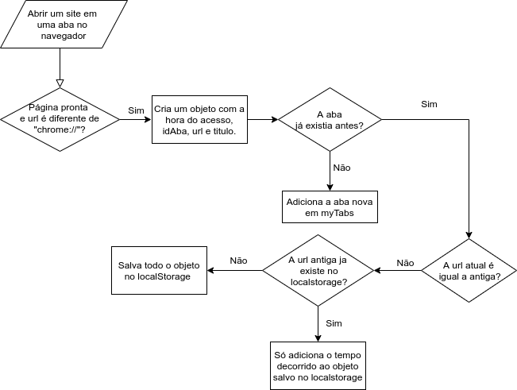
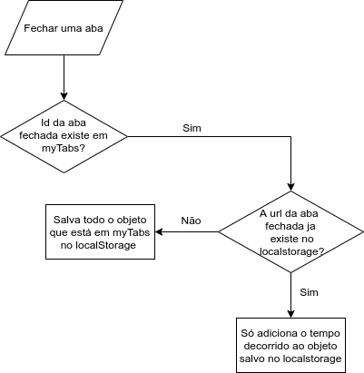

# Extensão para contabilizar o tempo passado em páginas Web (Google Chrome)

- O intuito deste tutorial é incentivar você que é iniciante, e que está sem ideias para criar projetos, a exercitar seus conhecimentos em Javascript. :blue_heart:

Obs.: Recomendo que você visite as documentações das tecnologias usadas.

## Resultado da extensão


## Tecnologias usadas
 - JavaScript
 - HTML5
 - CSS3
 - [Chartjs](https://www.chartjs.org/)
 - [Chrome Web APIs](https://developer.chrome.com/apps/api_index)
 - [Chrome extension tutorial*](https://developer.chrome.com/extensions/getstarted)
 
 ## Explicando a ideia da extensão
 
 A ideia é criar uma extensão para o Google Chrome visando contabilizar quanto tempo uma página Web (site) fica aberta em nossos navegadores. Vamos partir do princípio que o tempo passado em uma página Web deve ser contabilizado desde o momento em que ela é carregada/inicializada até o momento que mudamos para outro site dentro da mesma aba ou a fechamos.
 
 ## O Código
 
 Primeiro de tudo devemos criar o arquivo `manifest.json`, nele iremos declarar informações sobre a nossa extensão e também alguns arquivos que iremos utilizar.
 
 ```json
 {
    "manifest_version": 2,
    "name": "Monitor de sites",
    "version": "0.0.1",
    "content_scripts": [
        {
            "matches": [
                "<all_urls>"
            ]
        }
    ],
    "background": {
        "scripts": ["background.js"],
    },
    "permissions": [
        "tabs"
    ],
    "browser_action": {
        "default_popup": "index.html",
        "default_icon": "work.png",
        "title": "Monitor de sites"
      }
}
 ```
 Irei explicar algumas propriedades desse arquivo que acho relevante saber para esse projeto. (Se quiser saber mais sobre o `manifest.json` acesse a [documentação do google](https://developer.chrome.com/extensions/manifest))
 
- A propriedade *background* é onde definimos o nosso script principal que mantém todo o gerenciamento de tempo em cada aba.
- A propriedade *permissions* serve para nos dar acesso a APIs que iremos utilizar na nossa extensão
- A propriedade *browser_action* define como o icone da nossa extensão será mostrado no canto superior direito do navegador e também qual conteúdo será apresentado para o usuário quando clicado.

### Arquivo background.js

Aqui temos acesso à API do **chrome**. Nele vamos "escutar" o objeto tabs, quando ele for atualizado e quando for fechado.

``` javascript
chrome.tabs.onUpdated.addListener(tabAtualizada)

chrome.tabs.onRemoved.addListener(tabFechada)

```

A função de callback **tabAtualizada** recebe três parâmetros de entrada *tabId, changeInfo, tab* onde:
- *tabId* é o id da tab atualizada
- *changeInfo* contém informações sobre o status da aba (se ela ja carregou ou se está carregando)
- Objeto *tab* que traz algumas informações referentes ao conteúdo carregado na aba.

Já a função de callback **tabFechada** traz apenas o id da aba fechada.

Na função **tabAtualizada** é preciso verificar se o status da página está como "complete" (se ela carregou) e também se a url da aba é diferente de "chrome://" pois o tempo em páginas referentes ao navegador não nos é interessante.
Para melhorar a visualização do algoritmo observe este fluxograma:



Já na função **tabFechada** seguiremos esta linha de pensamento:



Todo o tempo passado nos sites é guardado em um array no localStorage. Quando vamos no arquivo `principal.js` e recuperamos essas informações do localStorage, é preciso:

- Criar um array com o nome dos sites acessados

```javascript
for(dado of dadosNavegacao) {
    sites.push(dado.titulo)
    let temp = dado.tempo / 60000
    temp = temp.toFixed(2)
    tempo.push(temp)
}
```

- Criar um array de cores de acordo com a quantidade de sites armazenados

```javascript
for (let i = 0; i <= Math.ceil(sites.length/6); i++) {
    cores = [...cores, ...coresPadrao]
    coresBorda = [...coresBorda, ...coresBordaPadrao]
}
```

- Criar o gráfico

```javascript
Chart.Bar('myChart', {
    data: {
        labels: sites,
        datasets: [{
            label: 'Tempo nos Sites (em minutos)',
            data: tempo,
            backgroundColor: cores,
            borderColor: coresBorda,
            borderWidth: 1
        }]
    },
    options: {
        maintainAspectRatio: false,
        tooltips: {},
        scales: {
            yAxes: [{
                ticks: {
                    beginAtZero: true
                }
            }],
            xAxes: [{
                ticks: {
                    display: false,
                    beginAtZero: true
                }
            }]
        }
    }
})
```

Espero que este tutorial tenha incentivado e ajudado você a criar uma extensão para o Google Chrome. 
:kissing_heart: .. :rainbow:
